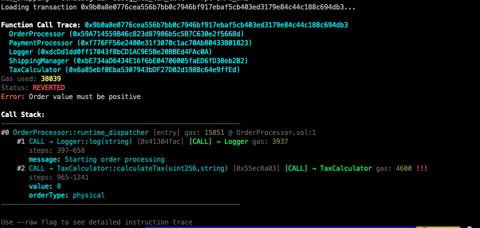

# SolDB EVM Debugger

A CLI debugger for the EVM and Solidity.



## Features

1. Full transaction traces with internal calls
2. Decoded arguments and results
3. Transaction simulation
4. Suport for custom RPC including local node (Anvil) or hosted

**Requirements**: Solidity compiler 0.8.29+ (for ETHDebug support)

## Installation Guide

### 1. Prerequisites

Before installing SolDB, ensure you have the following:

- **Python 3.7+** (for SolDB itself)
- **Solidity compiler** (version 0.8.29+ for ETHDebug support)
- **Foundry** (for contract deployment and Anvil node)

**Install Solidity:**
```bash
# macOS
brew install solidity
# Ubuntu
sudo apt-get install solc
# Or download from https://github.com/ethereum/solidity/releases

# Verify version (must be 0.8.29 or higher)
solc --version
```

**Install Foundry:**
```bash
curl -L https://foundry.paradigm.xyz | bash
foundryup
```

---

### 2. Install SolDB

You can install SolDB either from source (recommended) or from PyPI.

#### **A. Install from Source (Recommended)**

1. **Clone the repository:**
   ```bash
   git clone https://github.com/yourusername/soldb.git
   cd soldb
   ```
2. **Set up a Python virtual environment:**
   ```bash
   python3 -m venv MyEnv
   source MyEnv/bin/activate
   ```
3. **Install Python dependencies:**
   ```bash
   pip install -r requirements.txt
   ```
4. **Install SolDB in editable mode:
   ```bash
   pip install -e .
   ```

#### **B. Install from PyPI**
> **Note:** The PyPI package may be less up-to-date.
```bash
pip install soldb
```

---

### 3. Initial Setup

After installation, run the setup script to configure your environment:

- **If running from source:**
  ```bash
  ./setup-soldb.sh
  ```
- **If installed via PyPI:**
  ```bash
  soldb-setup
  ```

This will:
- Check for Solidity compiler with ETHDebug support (0.8.29+)
- Configure RPC endpoint (default: http://localhost:8545 for Anvil)
- Configure private key (default: Anvil's test account #0)
- Create `soldb.config.local` with your settings

---

### 4. Verify Your Setup

```bash
./test-setup.sh   # Test configuration (if running from source)
```

---

### 5. Next Steps

- See [Usage](#usage) for how to deploy, interact, and debug contracts.
- See [Configuration](#configuration) for advanced settings.

---

## Configuration

Configuration is stored in `soldb.config.local` (gitignored). You can also:

- Override settings with environment variables
- Use command-line options for specific tools

### Configuration Options

```bash
# Ethereum RPC endpoint
RPC_URL="http://localhost:8545"

# Private key for deployments (default: Anvil's test account #0)
PRIVATE_KEY="0xac0974bec39a17e36ba4a6b4d238ff944bacb478cbed5efcae784d7bf4f2ff80"

# Debug output directory
DEBUG_DIR="debug"
```

## Usage

### 1. Run Anvil node with tracing enabled

```bash
# Run Anvil with step tracing enabled (required for debugging)
$ anvil --fork-url https://reth-ethereum.ithaca.xyz/rpc --optimism --steps-tracing
```

**Important**: The `--steps-tracing` flag is required for SolDB to get execution traces.

### 2. Deploy a Contract

Deploy a Solidity contract with debug information:

```bash
# Deploy TestContract example
./scripts/deploy-contract.sh TestContract examples/TestContract.sol

# Deploy your own contract
./scripts/deploy-contract.sh Counter src/Counter.sol

# # Deploy Contract with Constructor Arguments
./scripts/deploy-contract.sh Ballot examples/Ballot.sol \                                                                                     
    '[0x416c696365000000000000000000000000000000000000000000000000000000, 0x426f620000000000000000000000000000000000000000000000000000000000, 0x436861726c696500000000000000000000000000000000000000000000000000]'

# With custom settings
./scripts/deploy-contract.sh \
  --solc=/path/to/custom/solc \
  --rpc=http://localhost:8545 \
  --debug-dir=my-debug \
  Counter src/Counter.sol
```

This will:
- Compile with ETHDebug support: `solc --via-ir --debug-info ethdebug --ethdebug`
- Deploy to the blockchain
- Save ETHDebug JSON files to `./debug/`
- Generate deployment info

### 2. Interact with Contract

Execute transactions and get transaction hashes for debugging:

```bash
# Get current value
./scripts/interact-contract.sh get

# Set a value
./scripts/interact-contract.sh set 42

# Increment
./scripts/interact-contract.sh inc 5

# Call arbitrary function
./scripts/interact-contract.sh call "myFunction(uint256,address)" 100 0x1234...
```
Or:

```
../scripts/interact-contract.sh send "complexCalculation(uint256,uint256)" 4 5
```

Each transaction returns a hash that can be debugged.

### 3. Debug a Transaction

```bash
# Debug with ETHDebug information
soldb trace 0x123... --ethdebug-dir ./debug

# Or if soldb.config.yaml is configured correctly
soldb trace 0x123...

# Show raw execution trace
soldb trace 0x123... --raw

# Output in JSON format
soldb trace 0x123... --ethdebug-dir ./debug --json
```

This shows a high-level function call trace with gas usage and source mappings.

### 4. Debug Multi-Contract Transactions

SolDB supports debugging transactions that involve multiple contracts, providing seamless source-level debugging across contract boundaries.

#### Loading Multiple Contracts

**Option 1: Multiple debug directories**
```bash
# Auto-detect contracts from deployment.json files
soldb trace 0x123... \
    --ethdebug-dir ./debug_controller \
    --ethdebug-dir ./debug_counter

# Specify address:path mapping
soldb trace 0x123... \
    --ethdebug-dir 0x44c4...9d64:./debug_controller \
    --ethdebug-dir 0x82e8...43fb:./debug_counter

# Or specify address:contract_name:path mapping
soldb trace 0x123... \
    --ethdebug-dir 0x44c4...9d64:Controller:./debug_controller \
    --ethdebug-dir 0x82e8...43fb:Counter:./debug_counter
```

**Option 2: Contract mapping file**
```bash
# Create a mapping file
cat > contracts.json << EOF
{
  "contracts": [
    {
      "address": "0x44c4caf8f075607deadf02dc7bf7f0166a209d64",
      "name": "Controller",
      "debug_dir": "./debug_controller"
    },
    {
      "address": "0x82e8f00d62fa200af7cfcc8f072ae0525e1a43fb",
      "name": "Counter",
      "debug_dir": "./debug_counter"
    }
  ]
}
EOF

# Use the mapping file
soldb trace 0x123... --contracts contracts.json
```

**Option 3: Enable multi-contract mode**
```bash
soldb trace 0x123... --multi-contract --ethdebug-dir ./debug/
```

#### Multi-Contract Output

When debugging multi-contract transactions, you'll see enhanced output:

```
Function Call Trace: 0x123...
Loaded contracts:
  Controller (0x44c4caf8f075607deadf02dc7bf7f0166a209d64)
  Counter (0x82e8f00d62fa200af7cfcc8f072ae0525e1a43fb)
Gas used: 72000

Call Stack:
------------------------------------------------------------
#0 Controller::runtime_dispatcher [entry] gas: 72000 @ Controller.sol:1
  #1 Controller::callIncrement [internal] gas: 65000 @ Controller.sol:15
    #2 call_to_Counter (0x82e8...43fb) [CALL → Counter] gas: 50000
      #3 Counter::increment [internal] gas: 45000 @ Counter.sol:8
        #4 Counter::_updateValue [internal] gas: 20000 @ Counter.sol:20
------------------------------------------------------------
```


### 5. Simulate a Transaction

You can simulate a contract call (without sending a real transaction) using the `simulate` command. Supports all Solidity argument types, including structs/tuples.

#### Basic usage

```bash
soldb simulate <contract_address> <function_signature> [function_args ...] --from <sender_address> --ethdebug-dir <debug_dir> [--block <block_number>] [--tx-index <index>] [--rpc-url <rpc_url>]
```

#### Example: Simple increment function

```bash
soldb simulate \
    0x5FbDB2315678afecb367f032d93F642f64180aa3 "increment(uint256)" 10 \
    --from 0xf39Fd6e51aad88F6F4ce6aB8827279cffFb92266 \
    --ethdebug-dir ./debug \
    --rpc-url "http://localhost:8545"
```

#### Example: Function with address argument

```bash
soldb simulate \
  0xcf7ed3acca5a467e9e704c703e8d87f634fb0fc9 \
  "giveRightToVote(address)" \
  0x70997970C51812dc3A010C7d01b50e0d17dc79C8 \
  --from 0x3C44CdDdB6a900fa2b585dd299e03d12FA4293BC \
  --ethdebug-dir ./debug_ballot
```

#### Example: Function with struct/tuple argument

```bash
soldb simulate \
  0x0165878a594ca255338adfa4d48449f69242eb8f \
  "submitPerson((string,uint256))" \
  '("Alice", 30)' \
  --ethdebug-dir ./debug_struct \
  --from 0x70997970C51812dc3A010C7d01b50e0d17dc79C8
```

#### Example: Nested struct/tuple argument

```bash
soldb simulate \
  0x0165878a594ca255338adfa4d48449f69242eb8f \
  "submitCompany((string,(string,uint256)))" \
  '("Acme Corp", ("Bob", 42))' \
  --ethdebug-dir ./debug_struct \
  --from 0x286AF310eA3303c80eBE9a66F6998B21Bd8c1c29
```
> Argument format is fully compatible with Foundry's `cast send` command (e.g. for structs: `'("Alice", 30)'`, for arrays: `'[("Alice", 30), ("Bob", 42)]'`).

#### Example: Using raw calldata

```bash
soldb simulate --raw-data 0x785bd74f000000000000000000000000000000000000000000000000000000000000002000000000000000000000000000000000000000000000000000000000000000400000000000000000000000000000000000000000000000000000000000000080000000000000000000000000000000000000000000000000000000000000000941636d6520436f727000000000000000000000000000000000000000000000000000000000000000000000000000000000000000000000000000000000000040000000000000000000000000000000000000000000000000000000000000002a0000000000000000000000000000000000000000000000000000000000000003426f620000000000000000000000000000000000000000000000000000000000 0xD7B5004e4124d26df1b03f3541e9653E706CCC40 \
  --ethdebug-dir ./debug_example \
  --from 0x286AF310eA3303c80eBE9a66F6998B21Bd8c1c29 
```

## Debug Information Formats

### ETHDebug Format

This approach is to use the standard ethdebug format from the Solidity compiler (requires Solidity 0.8.29+):

1. **Generate ethdebug information**:
   ```bash
   # Requires solc 0.8.29 or higher
   solc --via-ir --debug-info ethdebug --ethdebug -o /tmp/ethdebug-output MyContract.sol
   ```
   This generates:
   - `ethdebug.json` - Compilation metadata
   - `MyContract_ethdebug.json` - Constructor/creation debug info
   - `MyContract_ethdebug-runtime.json` - Runtime debug info

2. **Trace transactions with ethdebug**:
   ```bash
   soldb trace 0x123...abc --ethdebug-dir /tmp/ethdebug-output
   ```

### Other formats

Currently, SolDB supports the standard ETHDebug format. Additional formats may be added in the future.

### Using SolDB after installation

After running `pip install -e .`, you can use SolDB directly from anywhere:

```bash
# The commands are available globally
soldb trace 0x123...
soldb trace 0x123...
soldb-setup          # Setup wizard
```

## Debugging Workflow

### Using Helper Scripts (Recommended)

1. **Write your contract**:
   ```solidity
   // src/Counter.sol
   contract Counter {
       uint256 public counter;
       
       function setNumber(uint256 newNumber) public {
           counter = newNumber;
       }
       
       function increment(uint256 amount) public {
           counter += amount;
       }
   }
   ```

2. **Deploy with debug info**:
   ```bash
   ./scripts/deploy-contract.sh Counter src/Counter.sol
   
   # Output:
   # Transaction: 0x123...
   # Contract deployed at: 0xabc...
   # ETHDebug files created in: debug/
   ```

3. **Interact and get transaction hash**:
   ```bash
   ./scripts/interact-contract.sh set 42
   # Returns: Transaction: 0x123...
   ```

4. **Debug the transaction**:
   ```bash
   soldb trace 0x123... --ethdebug-dir ./debug
   # Shows function call trace with proper function names
   ```

### Manual Workflow (Without Scripts)

If you prefer to compile, deploy, and interact manually:

1. **Compile with ETHDebug support**:
   ```bash
   # Create debug directory
   mkdir -p debug
   
   # Compile with ETHDebug (requires solc 0.8.29+)
   solc --via-ir --debug-info ethdebug --ethdebug --ethdebug-runtime \
        --bin --abi --overwrite -o debug \
        examples/TestContract.sol
   ```

2. **Deploy using cast (Foundry)**:
   ```bash
   # Get the bytecode
   BYTECODE=$(cat debug/TestContract.bin)
   
   # Deploy (using Anvil's default account)
   cast send --rpc-url http://localhost:8545 \
             --private-key 0xac0974bec39a17e36ba4a6b4d238ff944bacb478cbed5efcae784d7bf4f2ff80 \
             --create "0x$BYTECODE" \
             --json
   
   # Note the contractAddress from the output
   ```

3. **Interact with the contract**:
   ```bash
   # Call a function (e.g., increment with value 5)
   # Replace CONTRACT_ADDRESS with your deployed address
   cast send CONTRACT_ADDRESS "increment(uint256)" 5 \
        --rpc-url http://localhost:8545 \
        --private-key 0xac0974bec39a17e36ba4a6b4d238ff944bacb478cbed5efcae784d7bf4f2ff80 \
        --json
   
   # Note the transactionHash from the output
   ```

4. **Debug the transaction**:
   ```bash
   # Use the transaction hash from step 3
   soldb trace 0xYOUR_TX_HASH --ethdebug-dir ./debug
   ```

### Reading contract state (view functions):
```bash
# Read public variables or view functions
cast call CONTRACT_ADDRESS "counter()(uint256)" --rpc-url http://localhost:8545
```

## Example Output

```
soldb trace 0x2832a995d3e50c85599e7aa0343e93aa77460d6069466be4b81dbc1ea21a3994 --ethdebug-dir debug --rpc http://localhost:8545
Loading transaction 0x2832a995d3e50c85599e7aa0343e93aa77460d6069466be4b81dbc1ea21a3994...
Loaded 1833 PC mappings from ethdebug
Contract: TestContract
Environment: runtime

Function Call Trace: 0x2832a995d3e50c85599e7aa0343e93aa77460d6069466be4b81dbc1ea21a3994
Contract: 0x380A1C6b118036364d84C3ecD305C2C11761A26c
Gas used: 50835
Status: SUCCESS

Call Stack:
------------------------------------------------------------
#0 TestContract::runtime_dispatcher [entry] gas: 29631 @ TestContract.sol:1
  #1 increment [0x7cf5dab0] [external] gas: 29241 @ TestContract.sol:23
     steps: 99-966
     amount: 23
    #2 increment2 [internal] gas: 6322 @ TestContract.sol:39
       steps: 296-966
       amount: 23
      #3 increment3 [internal] gas: 5172 @ TestContract.sol:54
         steps: 529-966
         amount: 0
------------------------------------------------------------

Use --raw flag to see detailed instruction trace
```

The raw output:
```
$ soldb trace 0x123...abc --ethdebug-dir debug --raw

Loaded 300 PC mappings from ethdebug
Contract: HelloWorld
Environment: runtime

Tracing transaction: 0x123...abc
Gas used: 21234

Execution trace (first 50 steps):
--------------------------------------------------------------------------------
Step | PC   | Op              | Gas     | Stack
--------------------------------------------------------------------------------
   0   0     PUSH1            1000000  [empty] <- HelloWorld.sol:4:1
   1   2     PUSH1            999997   [0] 0x80... <- HelloWorld.sol:4:1
   2   4     MSTORE           999994   [0] 0x80... [1] 0x40... <- HelloWorld.sol:4:1
   3   5     PUSH1            999991   [empty] <- HelloWorld.sol:4:1
   4   7     CALLDATASIZE     999989   [0] 0x04... <- HelloWorld.sol:4:1
   5   8     LT               999987   [0] 0x04... [1] 0x24 <- HelloWorld.sol:4:1
...
```

The output of reverted transaction

```
soldb trace 0x9b0a8e0776cea556b7bb0c7946bf917ebaf5cb403ed3179e84c44c188c694db3 --ethdebug-dir debug_order --ethdebug-dir debug_payment --ethdebug-dir debug_logger --ethdebug-dir debug_shipping_manager --ethdebug-dir debug_tax_calculator --rpc http://localhost:8545
Loading transaction 0x9b0a8e0776cea556b7bb0c7946bf917ebaf5cb403ed3179e84c44c188c694db3...

Function Call Trace: 0x9b0a8e0776cea556b7bb0c7946bf917ebaf5cb403ed3179e84c44c188c694db3
  OrderProcessor (0x59A714559B46c823d87986b5c5B7C630e2f5668d)
  PaymentProcessor (0xf776FF56e2400e31f3070c1ac70Ab80433B01823)
  Logger (0xdcDd1dd0ff17043f8bCD1AC9E5Be20BBEd4FAc0A)
  ShippingManager (0xbE734aD6434E16f6bE04706005faED6fD38eb2B2)
  TaxCalculator (0x6a85ebf0Eba5307943bDF27D02d198Bc64e9ffEd)
Gas used: 38039
Status: REVERTED
Error: Order value must be positive

Call Stack:
------------------------------------------------------------
#0 OrderProcessor::runtime_dispatcher [entry] gas: 15851 @ OrderProcessor.sol:1
    #1 CALL → Logger::log(string) [0x41304fac] [CALL] → Logger gas: 3937
       steps: 397-658
       message: Starting order processing
    #2 CALL → TaxCalculator::calculateTax(uint256,string) [0x55ec8a03] [CALL] → TaxCalculator gas: 4600 !!!
       steps: 965-1241
       value: 0
       orderType: physical
------------------------------------------------------------

Use --raw flag to see detailed instruction trace
```


## Run tests

```bash
cd test
./run-tests.sh SOLC_PATH=/path/to/solc
```

It expects RPC at `http://localhost:8545` (Anvil default) and uses Anvil's test account private key by default.
Also, it uses LLVM's `lit` and `FileCheck` tools, so please install it.

## License

SolDB is licensed under the Business Source License 1.1 (BSL). You may use, self-host, and modify SolDB for non-commercial purposes.

To use SolDB in a commercial product or service (e.g. as a SaaS offering), you must obtain a commercial license.

📄 [Full license text](./LICENSE.md)  
📬 Contact: hi@walnut.dev

